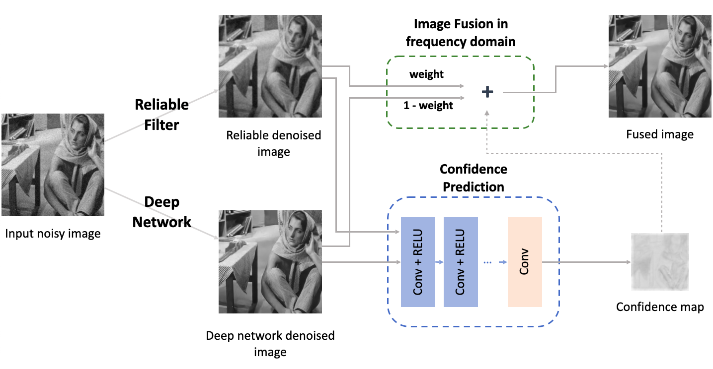

#  Image Denoising with Control over Deep Network Hallucination

#### [Paper](https://infoscience.epfl.ch/record/291129?&ln=en)

#### Our frequency-domain insights derive from [SFM](https://github.com/majedelhelou/SFM) and the concept of restoration reliability from [BUIFD](https://github.com/majedelhelou/BUIFD) and [BIGPrior](https://github.com/majedelhelou/BIGPrior)

**Authors**: Qiyuan Liang, Florian Cassayre, Haley Owsianko, [Majed El Helou](https://majedelhelou.github.io/), and Sabine Süsstrunk


## CCID framework
The figure below illustrates the CCID framework. By exploiting a reliable filter in parallel with a deep network, fused in the frequency domain, it enables users to control the hallucination contributions of the deep network and safeguard against its failures. 
<p align="center">
  
</p>


> **Abstract:** *Deep image denoisers achieve state-of-the-art results but with a hidden cost. As witnessed in recent literature, these deep networks are capable of overfitting their training distributions, causing inaccurate hallucinations to be added to the output and generalizing poorly to varying data. For better control and interpretability over a deep denoiser, we propose a novel framework exploiting a denoising network. We call it controllable confidence-based image denoising (CCID). In this framework, we exploit the outputs of a deep denoising network alongside an image convolved with a reliable filter. Such a filter can be a simple convolution kernel which does not risk adding hallucinated information. We propose to fuse the two components with a frequency-domain approach that takes into account the reliability of the deep network outputs. With our framework, the user can control the fusion of the two components in the frequency domain. We also provide a user-friendly map estimating spatially the confidence in the output that potentially contains network hallucination.
Results show that our CCID not only provides more interpretability and control, but can even outperform both the quantitative performance of the deep denoiser and that of the reliable filter. We show deep network hallucination can be exploited when the test data are similar to the training data, but is otherwise detrimental.*


## Structure overview
The code is structured as follows: 
`pipeline.py` and `pipeline_no_gui.py` implement the overall logic of the pipeline. All denoiser related code is stored inside the `denoiser` folder, confidence prediction code in the `confidence` folder, and frequency-domain fusion related code in the `fusion` folder. The `library` folder contains the datasets and deep learning models that we use for evaluation.

## Run the program
- With visualization: \
  ```python3 -m CCID.pipeline``` \
  For the visualization to work, you might need to install the `tkinter` module if it is not already present. Users can use the left and right arrows to switch the selected images.
- Without visualization: \
  ```python3 -m CCID.pipeline_no_gui``` \
  The list of arguments can be retrieved with the `--help` flag.

## Confidence prediction network
In the `confidence` folder, there are \
**(1)** `data_generation.py` generates the data used for training the confidence prediction network. Given the clean image, our current implementation augments the data by rotating, flipping, and scaling. A random Gaussian noise component with level ranging in `0-100` is added to the image to simulate the scenario of out-of-distribution noise levels. It may be extended to include also different noise types and different image domains.

**(2)** `confidence_train.py` trains the novel confidence prediction network. The training argumentation is not given in args, but is a built-in value inside the file.

**(3)** `confidence.py` provides the high-level confidence prediction (testing) API: the prediction is performed given the noisy image and its denoised version, the result is a confidence map with lower resolution.


## Citation
```bibtex
@article{liang2022image,
    title   = {Image Denoising with Control over Deep Network Hallucination},
    author  = {Liang, Qiyuan and Cassayre, Florian and Owsianko, Haley and El Helou, Majed and S\"usstrunk, Sabine},
    journal = {IS&amp;T Electronic Imaging Proceedings, Computational Imaging XX},
    year    = {2022}
}
```
